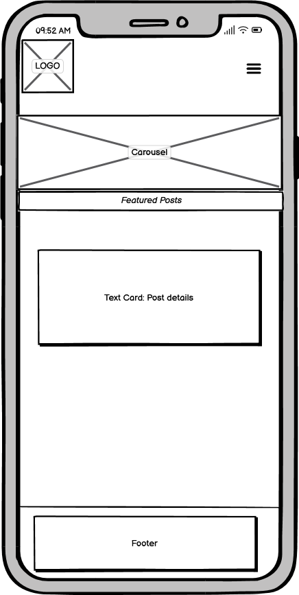

# AutoMate – Portfolio Project 4

## [Link to live web application](https://automate-pp4.herokuapp.com/)

---

## Project Documentation
### Welcome to [AutoMate](https://automate-pp4.herokuapp.com/)

---

## Table of Contents

-   [The Story](#the-story)
-   [User Experience (UX)](#user-experience-ux)
    -   [Target Audiance](#target-audiance)
    -   [Objectives](#objectives)
    -   [User Stories](#user-stories)
    -   [Colour Palette](#colour-palette)
    -   [Wireframes](#wireframes)

- [Technical Design](#technical-design)
    -   [Flowchart](#flowchart)
    -   [Data Model](#data-model)

-   [Website Features](#website-features)
    -   [Application Elements](#application-elements)

-   [Future Features](#future-features) 

-   [Testing](#testing)
    -   [Manual Testing](#manual-testing) 

-   [Validation](#validation)
    -   [Python](#python)

-   [Bug Fixes](#bug-fixes)

-   [Deployment](#deployment)
    -   [Local Deployment](#local-deployment)
    -   [Heroku Deployment](#heroku-deployment)

-   [Technologies Used](#technologies-used)
    -   [Hardware](#hardware)
    -   [Software](#software)
    -   [Platforms](#platforms)
    -   [Libraries](#libraries)
        -   [Local Libraries](#local-libraries)
        -   [Third Party Libraries](#third-party-libraries)

-   [Credits and References](#credits-and-references)
    -   [Code Structure](#code-structure)
    -   [Library Information](#library-information)
    -   [Theory](#theory)

-   [Acknowledgements](#acknowledgements)

-   [Closing Remarks](#closing-remarks)

---

## The Story

---

## User Experience (UX)

### Target Audiance

This project targets the general audiance inclusive of all ages. It is reccomended that the players have at least a good comprehension of the English language and are familiar with quiz games.

### Objectives

User Objectives

- 

Developer Objectives

- 

### User Stories

User

-   

Developer

-   

### Colour Palette

[Coolors](https://coolors.co/) was a highly beneficial resource in this regard which provided significant help in identifying
matching colours that also have appropriate contrast.

---

### Wireframes

Home Page

#### Mobile

---

## Technical Design

### Flowchart

### Data Model

---

## Website Features

The design considerations that impacted the envisioned features were mainly structured around CLI-based considerations. While there were more features planned in the initial stages of the project, some were not entertained to the benefit of serving the needs referenced in the [User Stories](#user-stories) section. Thus, it was important to focus on a minimum viable project rather than prioritizing the implementation of further features for the sake of it. This would only bloat the application without adding much real value to the user experience overall.

### Application Elements

The below elements are available to be experienced by the user across the quiz game application as a whole.

#### Welcome Logo

---

## Future Features

#### 

---

## Testing 

### Manual Testing

User Stories Testing

1. 

| **Feature**   | **Action**                    | **Expected Result**          | **Actual Result** |
| ------------- | ----------------------------- | ---------------------------- | ----------------- |
|  |  |  |  |

Screenshot

---

## Validation

### PYTHON

---    

## Bug Fixes

In this section, all bugs that cased fatal errors that prevented the successful execution of the application and their relevant fixes are provided.

| **Bug** | **Fix** |
| ------- | ------- |
| get_username() 'None' Text Display: A bug where a 'None' text appeared during when the system was expecting input from the user for their username. | Fixed by removing the print element nested inside an outer input element. Click [here](https://github.com/beratzorlu/python-quiz/commit/d3fc300dc47d88aecd65f99b7ab7cbb6ca6f13b7) to review the relevant commit. |

---

## Deployment

This application has been deployed by using the Heroku cloud platform. Please find below the neccessary procdures to replicate the deployment process.

You can find a [template](https://github.com/Code-Institute-Org/python-essentials-template) prepared by Code Institute that is designed to display this backend application in a modern web browser. This allows the project to be accessible for users without the need of any third party software other than an Internet browser application.

### Local Deployment 

Gitpod IDE is the development environment for this project.

If you wish to make copy of this repository locally, you can clone it by inputting the following code into your preferred integrated development environment (IDE):
- `git clone https://github.com/beratzorlu/python-quiz.git`

As anoher method, you can click below button to create your own workspace using this repository if you are using Gitpod.e

### Heroku Deployment

This project utilizes the services available at [Heroku](https://www.heroku.com). Heroku is a platform as a service (PaaS) that allows users to build, deploy, and control applications in a cloud environment.

Disclaimer: To be able successfully replicate the Heroku deployment process, it is highly reccomended that users setup an account on the platform prior to following the steps provided below.

- Select *New* in the top-right corner of your Heroku Dashboard after log-in.
- Select navigate to the *Create new app* button from the dropdown menu and select it.
- Assign a unique name to your application.
- Navigate to the *region* dropdown menu and select the region closest to you from either EU or USA. 
- Select *Create App*.
- Navigate to your newly created application and select *Settings*. 
- Click *Reveal Config Vars*.
- Add first *Config Var*.
- Set the value of KEY to `CREDS`, copy and paste the data in your credentials file (ie. creds.json) into the value area.
- Add second *Config Var*.
- Set the value of KEY to `PORT`, and the value to `8000` then select *add*.
- You need to add support to dependencies to be able to successfully deploy application, select *Add Buildpack*.
- The order in which you list your dependencies is critical, select `Python` as the first dependency.
- From the same menu, select `Node.js` after you select `Python`. (You can drag the list items upwards and downwards to change their order if needed.)
- Scroll until you find your desired deployment method, select `Enable Automatic Deploy` to rebuild your project automatically every time you push a new commit. Select `Manual Deployment` to manually deploy from your desired branch on will.*

*If you have selected automatic deployment, your application will only deploy after your first push to the system.

After the completion of this process, Heroku needs two files further to deploy successfully. These are;
    - requirements.txt
    - Procfile

To install your project's requirements use: `pip3 install -r requirements.txt`. 

If you have third party packages in your project the requirements file needs updated, use: `pip3 freeze --local > requirements.txt`

To create your Procfile, use: `echo web: node index.js > Procfile`

For Heroku deployment, follow these steps to connect your GitHub repository to the newly created app:

- In the Terminal (CLI), connect to Heroku using this: `heroku login -i`
- Set the remote for Heroku: `heroku git:remote -a <app_name>` (replace <app_name> with your chosen name for your application without the angle-brackets)
- Input commands `git add`, `git commit`, and `git push` to GitHub sequentially.
- Finally, type `git push heroku main` in the terminal to connect to Github.

Alternatively, you can connect to your Github account by following the below steps on Heroku's platform.

- Navigate to your Heroku account dashboard.
- Find the relevant project and click on its icon.
- On the next page, navigate to the `Deploy` subsection.
- Scroll down until you find `Deployment method` and find `Use Github`.
- Finally, input your Github account credentials to complete the process. 

---

## Technologies Used

### Hardware

- Monster Abra A5 V13.4 15.6" Laptop
- Lenovo IdeaPad 3i 14" Laptop
- Samsung VA 1920x1080 144Hz Curved Gaming Monitor
- iPhone 11
- Ipad Air 5th Generation
- Samsung A51

### Software

- Mozilla Firefox: Main browser used for development, testing and device simulation.
- Google Chrome: Secondary browser for testing and device simulation.
- Microsoft Edge: Tertiary browser for testing.
- Firefox Mobile: Mobile testing of the deployed site.
- Chrome Mobile: Mobile testing of the deployed site.
- Safari Mobile: Mobile testing of the deployed site.
- Windows Snip & Sketch: Capturing screenshots for readme and archiving identified bugs.
- Microsoft Snipping Tool: Fallback screen capture software when MS Snip & Sketched became unresponsive.
- DiffChecker: Comparing code to identify issues, solutions and ideas.
- Python Checker: Checking the syntax of Python code.
- Patorjk: Generating custom ASCII art.

### Platforms

- GitHub: Version control and site deployment.
- GitPod: Integrated Development Environment (IDE) chosen for this project.
- Google Fonts: Finding and exporting third-party fonts for the website.
- CodePen: For quickly testing out ideas before carrying them to 
DevTools.
- Coolors: For creating a matching colour palette that has appropriate contrast.
- Google Cloud: For accessing a library of Google-based API services.
- Google Drive API: For communicating with a cloud service to upload data.
- Google Sheets API: For reading and writing automated data to a cloud-hosted spreadsheet file.

### Libraries

#### Local Libraries

os - Used to clear terminal.
sys, sleep, time - Used to create a typing effect in various sections of the application.

#### Third Party Libraries

---

## Credits and References

### Code Structure

- [Code Institute](https://codeinstitute.net/): I would like to thank Code Institute for their support and guidance throughout the development of this project.

- [W3Schools](https://www.w3schools.com/): This website has been key in understanding and getting further practice with various approaches to coding with Python3.

- [Stack Overflow](https://stackoverflow.com/): This project heavily made use of Stack Overflow for troubleshooting problems that occurred throughout the development process. Below is are entries used to supplament this project.

### Library Information

- [The Python Package Index (PyPI)](https://pypi.org/): PyPI was critical in accessing libraries that added functionality to the project that otherwise would be impossible to feature in the end product.

- [Code Insitute](https://codeinstitute.net/ie/): The theory available in the Code Institute curriculum has been central in successfully setting up and utilizing Google Cloud API services for this project.

### Theory

- [UCD Professional Academy](https://www.ucd.ie/professionalacademy/): I would like to thank UCD PA for their facilitator and masterclass sessions in partnership with Code Insitute. These have been invaluable in better understanding relevant theory and practice elements.

---

## Acknowledgements

I would like to first and foremost thank my mentor, Rohit Sharma, for his dedication to helping me find direction in developing my projects and understand the fundamental considerations in growing as a software developer. Moreover, the tutor support available at Code Institute has been an excellent help in finding solutions to various issues I came across in the development process that I needed help. Lastly, the Slack community at Code Institute has been nothing less than inspirational. I commend their dedication to a constructive culture that strives to help future developers in their struggles towards their software development journey. 

--- 

## Closing Remarks

---
 [Back to Top](#table-of-contents)