# AutoMate – Portfolio Project 4

## [Link to live web application](https://automate-pp4.herokuapp.com/)

---

## Project Documentation
### Welcome to [AutoMate](https://automate-pp4.herokuapp.com/)

---

## Table of Contents

-   [User Experience (UX)](#user-experience-ux)
    -   [Target Audiance](#target-audiance)
    -   [User Stories](#user-stories)
    -   [Typography](#typography)
    -   [Colour Palette](#colour-palette)
    -   [Wireframes](#wireframes)

- [Technical Design](#technical-design)
    -   [Flowchart](#flowchart)
    -   [Data Model](#data-model)

-   [Website Features](#website-features)
    -   [Application Elements](#application-elements)

-   [Future Features](#future-features) 

-   [Testing](#testing)
    -   [Manual Testing](#manual-testing) 

-   [Validation](#validation)
    -   [Python](#python)

-   [Bug Fixes](#bug-fixes)

-   [Deployment](#deployment)
    -   [Local Deployment](#local-deployment)
    -   [Heroku Deployment](#heroku-deployment)

-   [Technologies Used](#technologies-used)
    -   [Hardware](#hardware)
    -   [Software](#software)
    -   [Platforms](#platforms)
    -   [Libraries](#libraries)
        -   [Local Libraries](#local-libraries)
        -   [Third Party Libraries](#third-party-libraries)

-   [Credits and References](#credits-and-references)
    -   [Code Structure](#code-structure)
    -   [Library Information](#library-information)
    -   [Theory](#theory)

-   [Acknowledgements](#acknowledgements)

-   [Closing Remarks](#closing-remarks)

---

## User Experience (UX)

### Target Audiance

This project targets the general audiance inclusive of all ages. It is tailored towards a base of interest towards Irish youths who have recently acquired their full driving license and are in the market to purchase their first second-hand car.

### User Stories

#### User

`(MUST HAVE)`

- As a user I can view a contact us page that presents correspondence information so that I can contact the company for my queries.
- As a registered user I can edit the comments I posted so that I can change the content I originally posted in my comment.
- As a registered user I can click on a clearly labelled button so that I can add a post without having to navigate the site too much. 
- As a registered user I can use a dedicated form to edit my blog so that I can make changes to my content when I feel there is a need to do so.
- As a user I can click on a clearly labelled button on a blog card so that I am easily directed to the details of the relevant full blog post.
- As a user I can view all the newest posts on the website so that I can directly access the most up-to-date content available on the website.
- As a user I can view a paginated list of posts so that I easily select a post to view.
- As an unregistered user I can use a password and username I choose so that I can securely access the user-exclusive features of the website.
- As an unregistered user I can easily understand the features and purpose statement of the website on an initial look so that I more easily make a decision whether I am interested in creating an account or not.
- As an unregistered I can sign up to create an account so that I can fully access the features available on the website.
- As a registered user I can log out of my account so that I can securely quit the current session active on my device.
- As a registered user I can log in to my account so that I access the full functionality of the website.
- As a registered user I can delete my posts so that my published content is removed.
- As a registered user I can view posts from other users so that I can access and read content posted by others.
- As a registered user I can navigate the site so that I can interact with the available features.
- As a registered user I can create new posts so that I can share my thoughts and opinions on the platform.
- As a user I can view the consultation page so that I can learn about the various consultation service that the site offers.
- As a registered user I can expand posts so that more information is available to me to help me engage with the post.
- As a registered I can remove comments that I posted so that they are no longer visible on the site.
- As a registered I can leave comments on other users' blog posts so that I share my thoughts on the content they have posted.
- As a registered user I can like other people's posts so that I inform them that I had a positive experience with their posts.

`(SHOULD HAVE)`

- As a user I can be directed to an error page so that I know something went wrong with the website.
- As an admin I can view all submitted blog posts in the backend so that I can reject or approve posts depending on their compliance with community guidelines.
- As a user I can easily see how many comments a post accumulated without clicking into it so that I can decide whether it's worth checking out.
- As a user I can see special styling for particular usernames in comments so that I can identify which users are admins.
- As a user I can browse a website that incorporates overall cohesion among its various elements so that I have an aesthetically pleasing user experience.
- As a user I can browse profiles of cars on the website so that I can leave a comment to share my thoughts and experience relevant to a model that I choose.
- As a registered user I can like a post without having to wait for the website to refresh so that I can have a more cohesive and smooth experience when interacting with posts.
- As a user I can view the number of comments on any post so that I see if the post is popular or not and decide if it's worth checking out based on this information.
- As an unregistered user I can use single sign-on capabilities so that have a smoother authentication process before I can access the features of the site.
- As a registered user I want to be able to be notified if I do something wrong while creating a comment so that I can make sure that everything is as expected before I can publish my content.
- As a registered user I can make my profile private so that my personal information is reserved for specific people that I feel comfortable with sharing such information
- As a registered user I can clearly see date/time information on a post so that I learn how old or new the post is to determine its relevance.

`(COULD HAVE)`

- As a user I can use the calculator functionality so that I get a rough idea about whether it's viable for me to finance a car purchase.
- As a user I can view the location of the HQ of the site so that I decide if I want to have a visit for networking.
- As a registered user I can message other users so that I can establish private communication with other users on the site.
- As a registered I can receive notifications when I get new followers so that I can check their profile.
- As a registered user I can receive notifications about any new likes and comments on my content so that I am informed of the engagement of my posts.
- As a registered user I can search for any user or post so that I can easily find the content and people that I am interested in.

`(WON'T HAVE)`

- As a registered user I can be notified of incoming correspondence from other users so that I can read their messages and decide if I want to reply back to them.
- As a registered user I can create my profile so that other users can identify me.
- As a registered user I can reset my password so that I can regain access to my account if I forget my password.
- As a registered user I can add a profile picture and cover photo so that I can further personalize my profile.
- As a registered user I can edit my profile so that I can personalize my profile.
- As a registered user I can follow other users so that I can see their blog posts.
- As a registered user I can unfollow users so that their posts are no longer visible on my feed.

#### Admin

`(MUST HAVE)`

- As an admin I can provide a disclaimer at the bottom of the page so that I can specify that all outsourced content (texts, images etc.) is used for purposes of education as a part of this academic project and is in no circumstance to be used for commercial motivations. 
- Deploy project to Heroku before the start of the production process to prevent major issues in this area considering later stages.
- As an admin I can approve or reject comments left by registered users so that I can ensure that the content available on the site follows the community guidelines.
- As an admin I can create draft posts so that I can come back to them when I want to.
- As an admin I can create, read, update and delete posts so that *I can manage my blog content.

`(SHOULD HAVE)`

- As an admin I can suspend a user's access to site functionality if required so that I can prevent them from violating any major community guidelines and ensure a safe space for the site's users.

`(COULD HAVE)`

- As an admin I can view all reported content by users so that I can make decisions on whether content removal and user punishment are necessary or not.
- As a registered user I can report posts that I find inappropriate in terms of site community guidelines so that such content is communicated to admins and appropriate measures are taken, ensuring an overall positive experience on the site.

### Typography

- [Bitter](https://fonts.google.com/specimen/Bitter) is the primary font that is present across all textual elements present in the project.

- [Sans Serif](https://fonts.google.com/knowledge/glossary/sans_serif) is the fallback font set in case the primary font fails.

- [Font Awesome](https://fontawesome.com) is the source for the various icons used to decorate the textual content available in the project.

### Colour Palette

[Coolors](https://coolors.co/) was a highly beneficial resource that provided significant help in identifying matching colours that also have appropriate contrast.

More importantly, this colour combination consists of items designed to motivate excitement from users through the use of vivid colour tones contrasted by darker colours to balance the overall feel of the design.

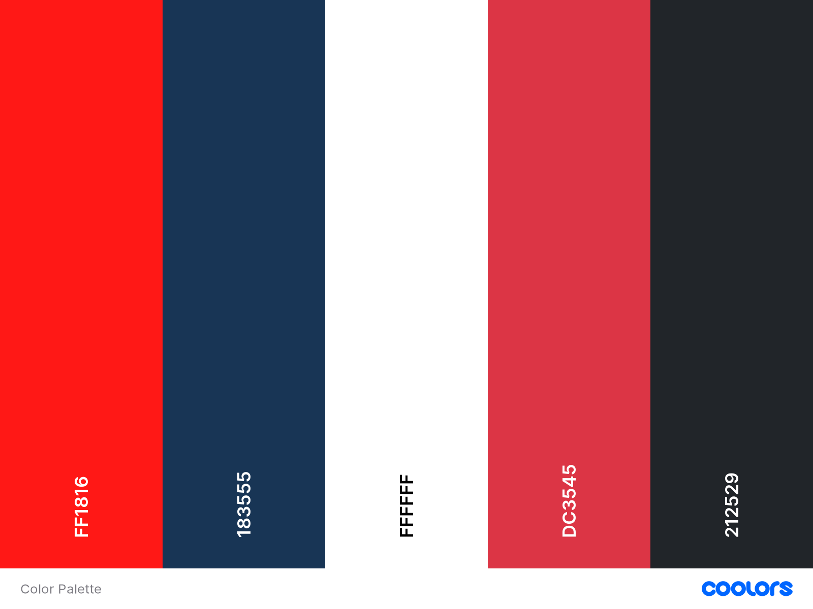

---

### Wireframes

Home Page

#### Mobile

#### Tablet
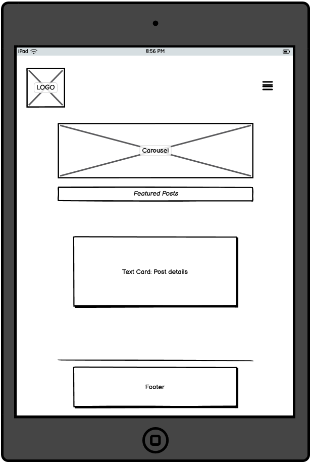

#### Desktop
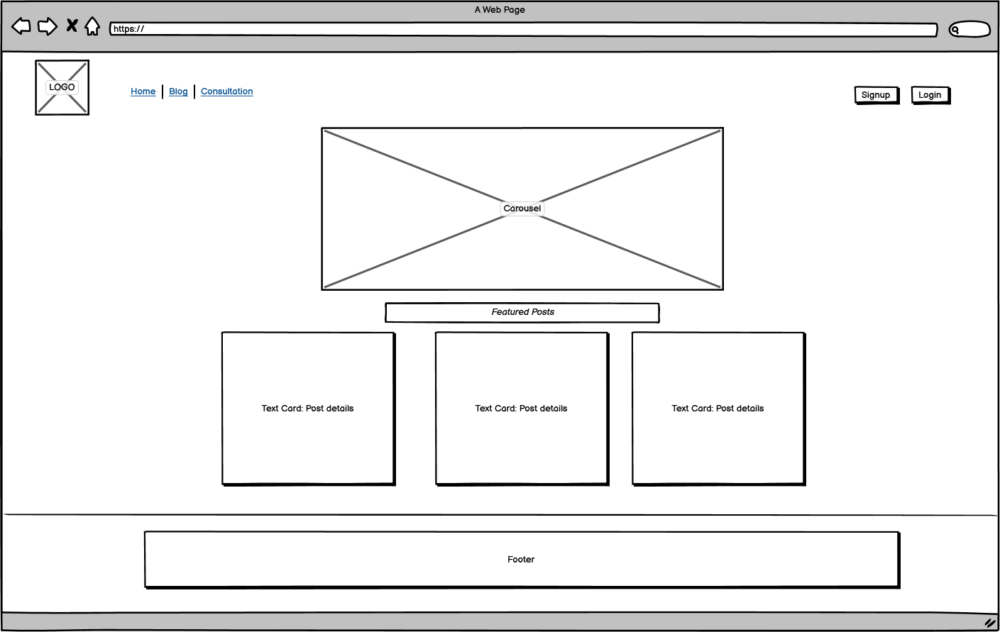

Blog Page

#### Mobile

#### Tablet
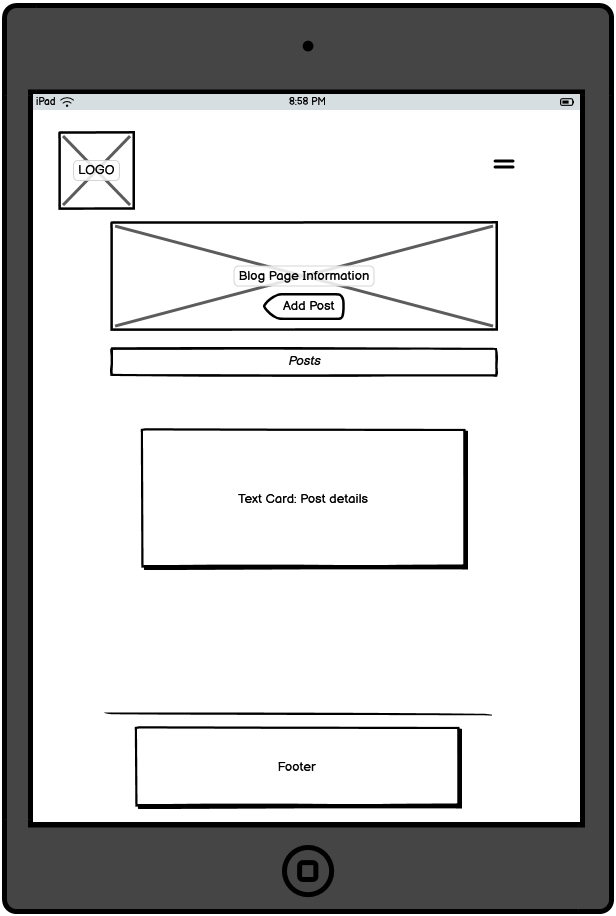

#### Desktop

Consultation Page

#### Mobile
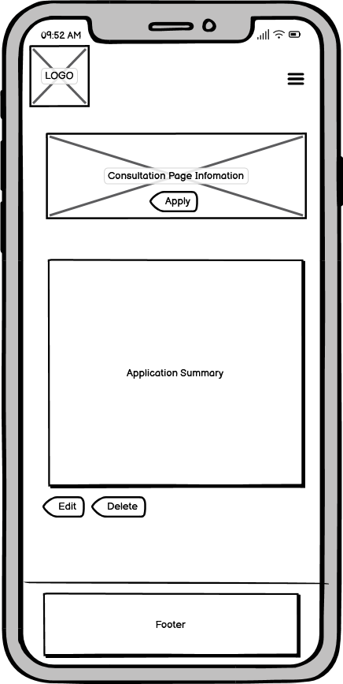

#### Tablet

#### Desktop

Forms Page

#### Mobile

#### Tablet

#### Desktop

Login Page

#### Mobile
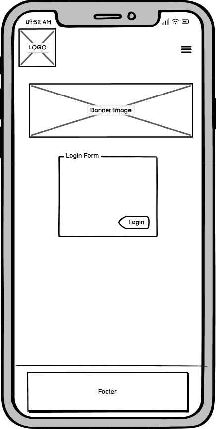

#### Tablet
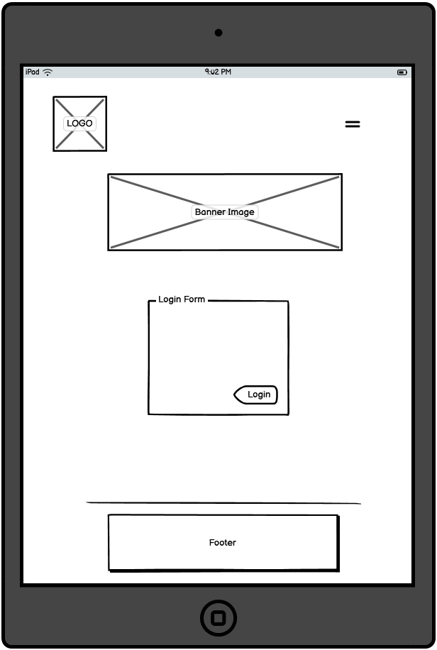

#### Desktop
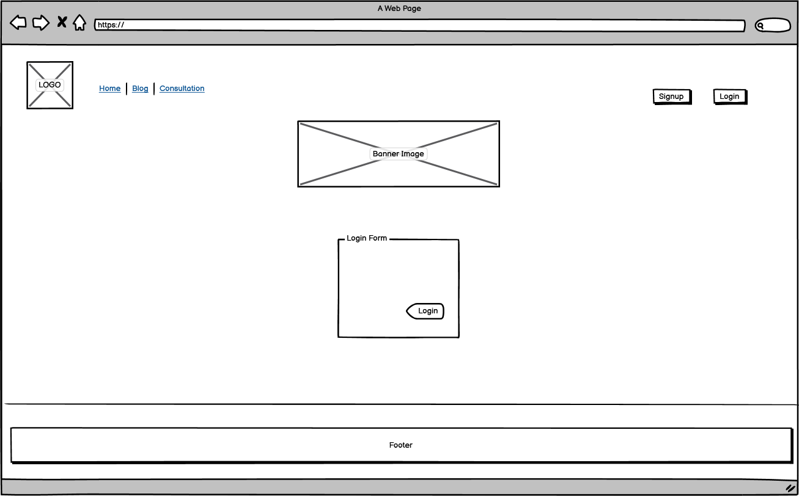

Sign Out Page

#### Mobile
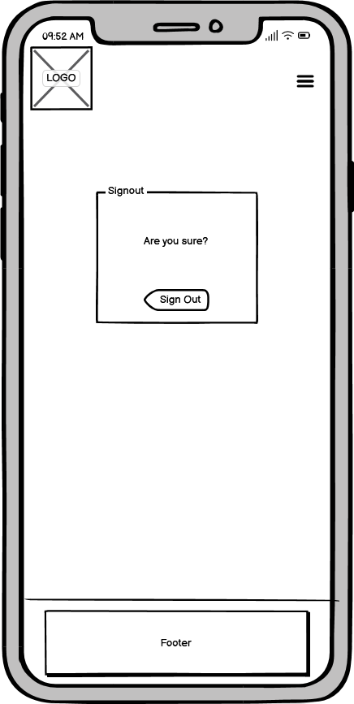

#### Tablet

#### Desktop

Blog Detail Page

#### Mobile
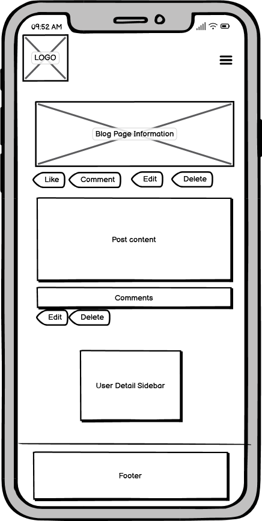

#### Tablet

#### Desktop
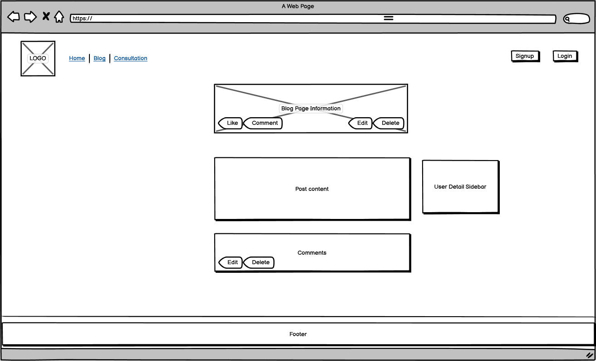

---

## Technical Design

### Data Model - Entity Relationship Diagram

[Draw.io](https://www.drawio.com/) was a highly beneficial resource that provided significant help in building a ERP to illustrate the various table relationships of data models present in the project.

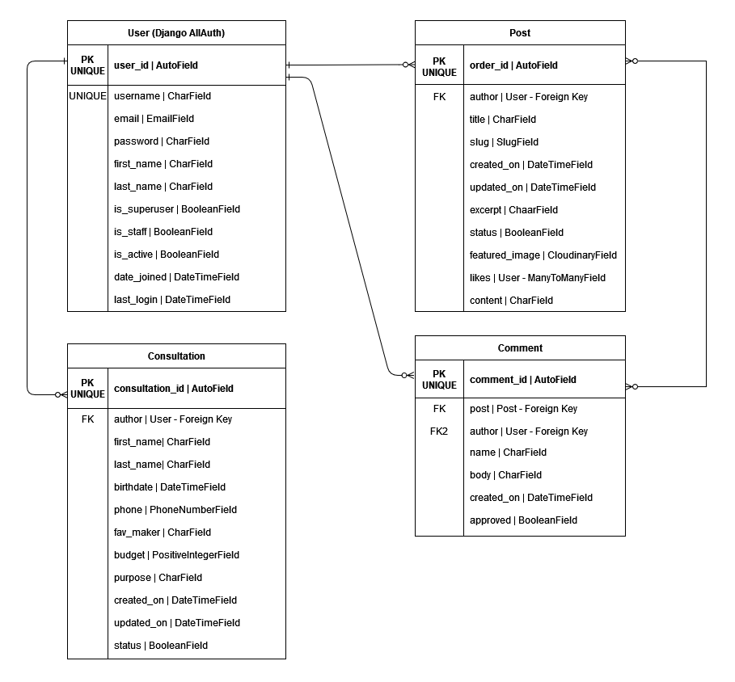

---

## Website Features

The design considerations that impacted the envisioned features were mainly structured around CLI-based considerations. While there were more features planned in the initial stages of the project, some were not entertained to the benefit of serving the needs referenced in the [User Stories](#user-stories) section. Thus, it was important to focus on a minimum viable project rather than prioritizing the implementation of further features for the sake of it. This would only bloat the application without adding much real value to the user experience overall.

### Application Elements

The below elements are available to be experienced by the user across the quiz game application as a whole.

#### Welcome Logo

---

## Future Features

#### 

---

## Testing 

### Manual Testing

User Stories Testing

1. 

| **Feature**   | **Action**                    | **Expected Result**          | **Actual Result** |
| ------------- | ----------------------------- | ---------------------------- | ----------------- |
|  |  |  |  |

Screenshot

---

## Validation

### HTML

| Page | W3C | Screenshot | Result |
| --- | --- | --- | --- |
| Home | [W3C]() |  |  |

### PYTHON

---    

## Bug Fixes

In this section, all bugs that cased fatal errors that prevented the successful execution of the application and their relevant fixes are provided.

| **Bug** | **Fix** |
| ------- | ------- |
| get_username() 'None' Text Display: A bug where a 'None' text appeared during when the system was expecting input from the user for their username. | Fixed by removing the print element nested inside an outer input element. Click [here](https://github.com/beratzorlu/python-quiz/commit/d3fc300dc47d88aecd65f99b7ab7cbb6ca6f13b7) to review the relevant commit. |

---

## Deployment

This application has been deployed by using the Heroku cloud platform. Please find below the neccessary procdures to replicate the deployment process.

You can find a [template](https://github.com/Code-Institute-Org/python-essentials-template) prepared by Code Institute that is designed to display this backend application in a modern web browser. This allows the project to be accessible for users without the need of any third party software other than an Internet browser application.

### Local Deployment 

Gitpod IDE is the development environment for this project.

If you wish to make copy of this repository locally, you can clone it by inputting the following code into your preferred integrated development environment (IDE):
- `git clone https://github.com/beratzorlu/python-quiz.git`

As anoher method, you can click below button to create your own workspace using this repository if you are using Gitpod.e

### Heroku Deployment

This project utilizes the services available at [Heroku](https://www.heroku.com). Heroku is a platform as a service (PaaS) that allows users to build, deploy, and control applications in a cloud environment.

Disclaimer: To be able successfully replicate the Heroku deployment process, it is highly reccomended that users setup an account on the platform prior to following the steps provided below.

- Select *New* in the top-right corner of your Heroku Dashboard after log-in.
- Select navigate to the *Create new app* button from the dropdown menu and select it.
- Assign a unique name to your application.
- Navigate to the *region* dropdown menu and select the region closest to you from either EU or USA. 
- Select *Create App*.
- Navigate to your newly created application and select *Settings*. 
- Click *Reveal Config Vars*.
- Add first *Config Var*.
- Set the value of KEY to `CREDS`, copy and paste the data in your credentials file (ie. creds.json) into the value area.
- Add second *Config Var*.
- Set the value of KEY to `PORT`, and the value to `8000` then select *add*.
- You need to add support to dependencies to be able to successfully deploy application, select *Add Buildpack*.
- The order in which you list your dependencies is critical, select `Python` as the first dependency.
- From the same menu, select `Node.js` after you select `Python`. (You can drag the list items upwards and downwards to change their order if needed.)
- Scroll until you find your desired deployment method, select `Enable Automatic Deploy` to rebuild your project automatically every time you push a new commit. Select `Manual Deployment` to manually deploy from your desired branch on will.*

*If you have selected automatic deployment, your application will only deploy after your first push to the system.

After the completion of this process, Heroku needs two files further to deploy successfully. These are;
    - requirements.txt
    - Procfile

To install your project's requirements use: `pip3 install -r requirements.txt`. 

If you have third party packages in your project the requirements file needs updated, use: `pip3 freeze --local > requirements.txt`

To create your Procfile, use: `echo web: node index.js > Procfile`

For Heroku deployment, follow these steps to connect your GitHub repository to the newly created app:

- In the Terminal (CLI), connect to Heroku using this: `heroku login -i`
- Set the remote for Heroku: `heroku git:remote -a <app_name>` (replace <app_name> with your chosen name for your application without the angle-brackets)
- Input commands `git add`, `git commit`, and `git push` to GitHub sequentially.
- Finally, type `git push heroku main` in the terminal to connect to Github.

Alternatively, you can connect to your Github account by following the below steps on Heroku's platform.

- Navigate to your Heroku account dashboard.
- Find the relevant project and click on its icon.
- On the next page, navigate to the `Deploy` subsection.
- Scroll down until you find `Deployment method` and find `Use Github`.
- Finally, input your Github account credentials to complete the process. 

---

## Technologies Used

### Hardware

- Monster Abra A5 V13.4 15.6" Laptop
- Lenovo IdeaPad 3i 14" Laptop
- Samsung VA 1920x1080 144Hz Curved Gaming Monitor
- iPhone 11
- Ipad Air 5th Generation
- Samsung A51

### Software

- Mozilla Firefox: Main browser used for development, testing and device simulation.
- Google Chrome: Secondary browser for testing and device simulation.
- Microsoft Edge: Tertiary browser for testing.
- Firefox Mobile: Mobile testing of the deployed site.
- Chrome Mobile: Mobile testing of the deployed site.
- Safari Mobile: Mobile testing of the deployed site.
- Windows Snip & Sketch: Capturing screenshots for readme and archiving identified bugs.
- Microsoft Snipping Tool: Fallback screen capture software when MS Snip & Sketched became unresponsive.
- DiffChecker: Comparing code to identify issues, solutions and ideas.
- Python Checker: Checking the syntax of Python code.
- Patorjk: Generating custom ASCII art.

### Platforms

- GitHub: Version control and site deployment.
- GitPod: Integrated Development Environment (IDE) chosen for this project.
- Google Fonts: Finding and exporting third-party fonts for the website.
- CodePen: For quickly testing out ideas before carrying them to 
DevTools.
- Coolors: For creating a matching colour palette that has appropriate contrast.
- Google Cloud: For accessing a library of Google-based API services.
- Google Drive API: For communicating with a cloud service to upload data.
- Google Sheets API: For reading and writing automated data to a cloud-hosted spreadsheet file.

### Libraries

#### Local Libraries

os - Used to clear terminal.
sys, sleep, time - Used to create a typing effect in various sections of the application.

#### Third Party Libraries

---

## Credits and References

### Code Structure

- [Code Institute](https://codeinstitute.net/): I would like to thank Code Institute for their support and guidance throughout the development of this project.

- [W3Schools](https://www.w3schools.com/): This website has been key in understanding and getting further practice with various approaches to coding with Python3.

- [Stack Overflow](https://stackoverflow.com/): This project heavily made use of Stack Overflow for troubleshooting problems that occurred throughout the development process. Below is are entries used to supplament this project.

### Library Information

- [The Python Package Index (PyPI)](https://pypi.org/): PyPI was critical in accessing libraries that added functionality to the project that otherwise would be impossible to feature in the end product.

- [Code Insitute](https://codeinstitute.net/ie/): The theory available in the Code Institute curriculum has been central in successfully setting up and utilizing Google Cloud API services for this project.

### Theory

- [UCD Professional Academy](https://www.ucd.ie/professionalacademy/): I would like to thank UCD PA for their facilitator and masterclass sessions in partnership with Code Insitute. These have been invaluable in better understanding relevant theory and practice elements.

---

## Acknowledgements

I would like to first and foremost thank my mentor, Rohit Sharma, for his dedication to helping me find direction in developing my projects and understand the fundamental considerations in growing as a software developer. Moreover, the tutor support available at Code Institute has been an excellent help in finding solutions to various issues I came across in the development process that I needed help. Lastly, the Slack community at Code Institute has been nothing less than inspirational. I commend their dedication to a constructive culture that strives to help future developers in their struggles towards their software development journey. 

--- 

## Closing Remarks

---
 [Back to Top](#table-of-contents)